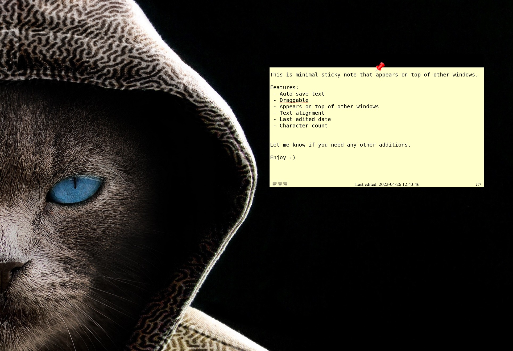

# Post it


This is minimal sticky note that appears on top of other windows.

Features:
 - Auto save text
 - Draggable
 - Appears on top of other windows
 - Text alignment
 - Last edited date
 - Character count


Let me know if you need any other additions.

Enjoy :)

---

## Download
### [Linux](https://drive.google.com/file/d/1di53vmAYfZMIWS_a4cHcaY4e2vkdeKaT/view?usp=sharing "Linux")
Extract, enter the folder and run in terminal `./post-it --enable-transparent-visuals --disable-gpu`

### [Windows](https://drive.google.com/file/d/1M9fyAtmLq_1-qPoA8x60x4-j_efkLuOJ/view?usp=sharing "Windows")

Extract, enter the folder and open `post-it.exe`

Recommend to run the program from a hotkey for quick access.

---

## Development

### To run and debug the app locally
```
git clone https://github.com/ThanosDi/post-it.git
cd post-it
yarn install
yarn run
```

### To build the app

```
yarn build:linux
yarn build:windows
```


#### Less is more.
